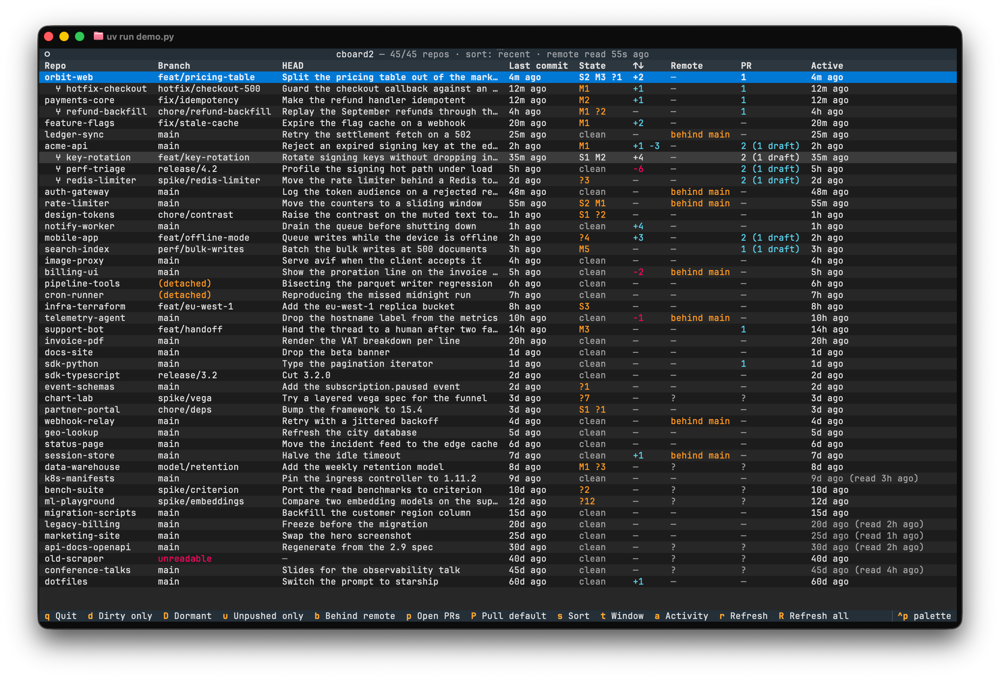

# cboard2

A terminal dashboard over every git repo on your disk. It walks `~/git`, polls
each repo's state from git every two seconds, and puts whatever you touched last
at the top.



## Requirements

Python 3.13 and git. A GitHub repo needs [`gh`](https://cli.github.com)
authenticated for its Remote and PR columns; without it those cells read `?` and
the rest still works.

## Install

```bash
uv tool install .
cboard2
```

## The dashboard

Each row is one repo:

| Column | Content |
|--------|---------|
| Repo, Branch | Name and current branch |
| HEAD | Subject of the last commit |
| Last commit | Age of that commit |
| State | `S2 M1 ?3` is two staged files, one modified, three untracked |
| `↑↓` | Commits ahead of and behind the upstream |
| Remote, PR | Which branch the origin has moved on, and your open PRs. `behind origin/fix` is the checked-out branch, `behind main` the default one. PRs come from GitHub; the branches come from any origin |
| Active | When you last touched the repo |

Active counts working-tree edits, not just commits, so an hour of uncommitted
work still sorts you to the top.

| Key | Does |
|-----|------|
| `enter` | Detail for the selected repo: remote state, your open PRs, changed files, branches, recent HEAD movements |
| `a` | Activity feed across all repos, read from their reflogs |
| `d` `u` `b` `p` | Filter to dirty / unpushed / behind / has-open-PR |
| `s` | Sort by recent, name, or dirty |
| `t` | Window: all, 1h, 1d, 7d, 30d |
| `D` | Toggle the selected repo dormant, and write that to the config file |
| `P` | Check out the default branch and pull it |
| `r` `R` | Poll now; `R` also ignores the dormant interval |
| `q` | Quit |

`P` is the only key that writes to a repo. Everything else reads.

## Scripting

```bash
cboard2 ls                  # the table, as plain columns
cboard2 ls --remote         # add the remote columns, served from the cache
cboard2 json --since 2h     # the same rows as JSON
cboard2 busy --since 5m     # exit 0 if anything moved in the last 5 minutes
```

`busy` is meant for a tmux statusline or a shell guard. `--since` takes `30s`,
`5m`, `2h`, `1d`. `--refresh` asks the origins now instead of reading the cache,
and implies `--remote`.

## Config

`~/.config/cboard2/config.toml`, or `$XDG_CONFIG_HOME/cboard2/config.toml`.
Every key has a default, so the file is optional.

```toml
roots = ["~/git", "~/work"]
max_depth = 2
dormant = ["~/git/old-thing"]
```

| Key | Default | Meaning |
|-----|---------|---------|
| `roots` | `["~/git"]` | Directories to search for repos |
| `max_depth` | `1` | Levels below a root to descend. Use `2` for `~/git/<org>/<repo>` |
| `dormant` | `[]` | Repos polled on the dormant interval instead of every tick |
| `dormant_interval` | `4h` | How often a dormant repo is polled |
| `remote` | `true` | Whether to ask any origin anything at all |
| `remote_interval` | `5m` | How often to ask |
| `worktrees` | `true` | Whether a repo's linked worktrees get rows of their own |

A dormant repo is still discovered, listed and readable. It is polled
rarely, so a shelf of archived clones costs nothing per second. `CBOARD2_CONFIG`
overrides the path.

A linked worktree gets a row of its own, indented as `  ⑂ worktree`, including
one kept inside its repo where the walk would never reach it. Every sort order
paints a repo and its worktrees as one block, placed where the most interesting
member of the group falls. The origin URL, the open PRs and the default branch
are read once for a repo and shown on every one of its worktrees, since they
share `refs`.

## Where the numbers come from

Two git calls per repo feed the table. `status --porcelain=v2 --branch` gives the
branch, dirty counts and ahead/behind; `log -1` gives the HEAD subject and its age.
Both run across a thread pool: 94 repos in 0.28s on the author's machine, which
makes a 2-second poll affordable.
The `--no-optional-locks` flag keeps the poller from taking `.git/index.lock`
while you are running git yourself.

Recent activity comes from each repo's reflog, which already records every HEAD
movement with a timestamp and a verb. Working-tree edits touch nothing under
`.git`, so "last edited" is the newest mtime among the paths git reports dirty.

The remote columns come from one batched GraphQL query for default branches and
checked-out branches, and one `gh search prs` for your open PRs. An origin that
is not on github.com gets `git ls-remote --symref origin HEAD` instead, with the
same branches named as extra refs, so a self-hosted or GitLab remote still
reports both; those repos show no PRs. cboard2 never fetches: rewriting
`refs/remotes/origin/*` under you would change what your next `git log` shows.

A checkout is compared against the branch its upstream names, or against the
same name on `origin` when it tracks nothing. A branch tracking another remote
is left unanswered, and the `↑↓` column keeps its own meaning: that one is read
from your remote-tracking refs and moves only when you fetch.

## Development

```bash
uv sync --group dev
just --list
```

`just lint-all` runs ruff and pyright. `just test` runs the suite; `just
test-changed` runs only what your edits touched.
